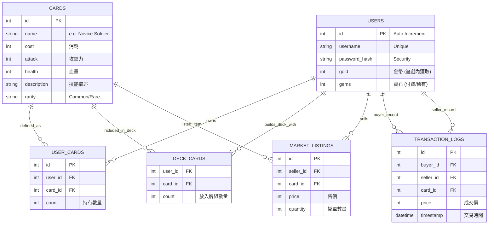
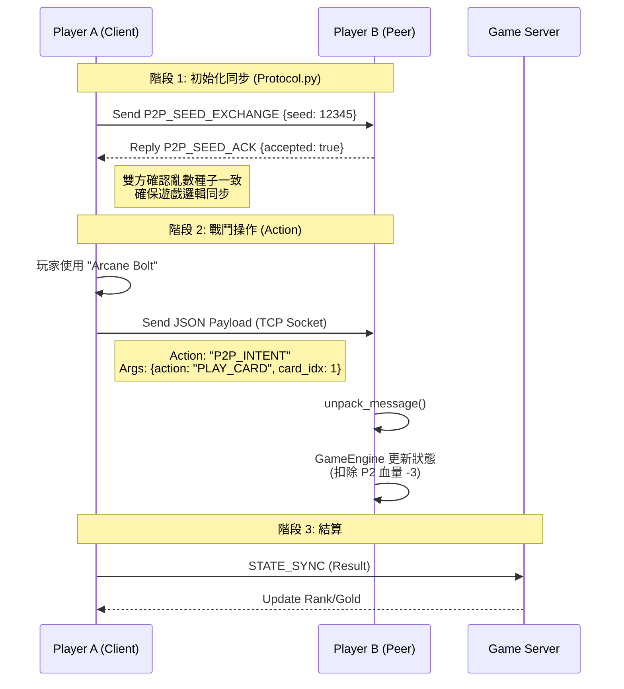

# CardGamePrototype

Prototype Online Collectible Card Game (CCG) in Python.

Overview
- Central server (meta-game): user auth, deck building, matchmaking, marketplace using SQLite.
- P2P in-game battles: deterministic seed exchange and intent-based actions between peers.

Quick start (server)

1. From the project root run the server:

```powershell
cd 'C:\Users\Chile\.vscode\workSpace\CardGamePrototype'
python .\src\server\server_main.py
```

2. The server will create `db/game.db` and seed two test users (alice / bob).

P2P battle (quick test)

1. Use the `src/p2p_network` modules to implement a simple local battle. A small example is provided in `scripts/test_p2p.py`.

Notes
- Networking uses newline-delimited JSON messages for the prototype. Each message is an object with `action` and `payload` fields.
- Determinism is achieved by exchanging a shared integer seed (P2P_SEED_EXCHANGE). Both peers use the same seed to initialize `RNGManager`.
- Marketplace buy operations use a single SQLite transaction (`BEGIN IMMEDIATE`) to maintain atomicity.

Files of interest
- `src/common/models.py` — dataclass for Card and JSON loader
- `src/common/protocol.py` — shared message names and pack/unpack helpers
- `src/server` — central server code (DB, auth, marketplace, matchmaking, server_main)
- `src/p2p_network` — RNG manager, peer handshake, and battle logic

License
Prototype code; feel free to adapt for learning or prototyping.




